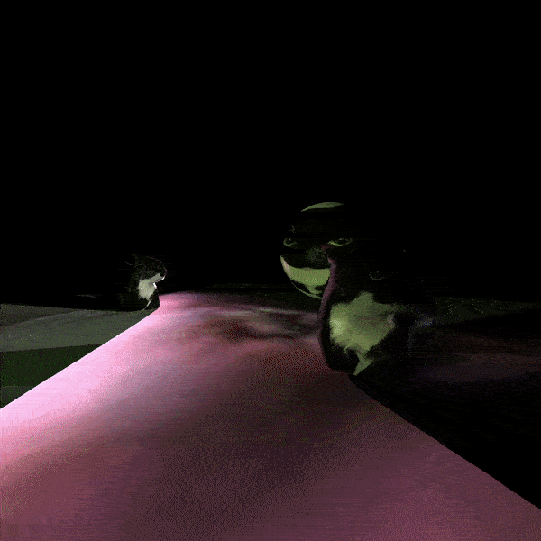

# REND Game Engine

<p align="center">
  
</p>

Vulkan based open-source, C++ game engine for 3D games

## Platforms

As of now only tested on Ubuntu 20.04
## Requirements
`Git submodules`
- [*Jolt Physics*](https://github.com/jrouwe/JoltPhysics)
- [*VulkanMemoryAllocator*](https://github.com/GPUOpen-LibrariesAndSDKs/VulkanMemoryAllocator)
- [*stb*](https://github.com/nothings/stb)
- [*vk-bootstrap*](https://github.com/charles-lunarg/vk-bootstrap)
- [*Dear ImGUI*](https://github.com/ocornut/imgui)

`Ubuntu packages`
- Eigen: ```libeigen3-dev```
- Assimp: ```assimp-utils```
- VMA: ```libvma-utils```
- GLSL Tools: ```lslang-tools```
- SDL2: ```libsdl2-dev```

```
sudo apt install assimp-utils libvma-utils glslang-tools libsdl2-dev
``` 
## Building

```
git clone 
git submodule update --init --recursive

mkdir build && cd build
cmake .. && make
```